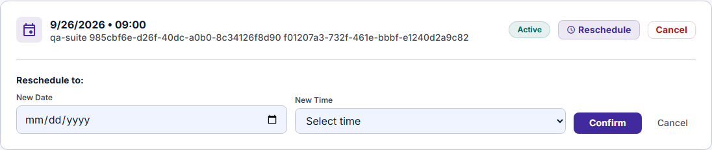
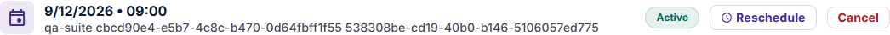
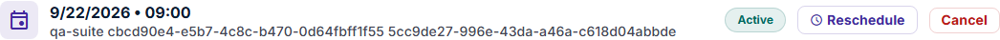
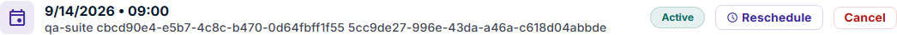
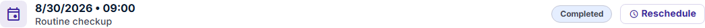
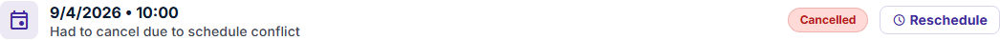
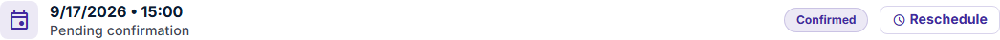

# Part 1 — Functional testing: rescheduling an appointment

> **User story:** *As a patient, I want to reschedule an existing appointment to another available time slot, without having to cancel and book from scratch.*

| | |
|---|---|
| **Recommendation** | **No-Go** — see [section 8](#8-conclusion-and-release-recommendation) |
| **Executed** | 2026-09-13, against the web app `https://light-it-qa-challenge.vercel.app` and the API `https://qa-challenge-backend.vercel.app` (OpenAPI "Medical Appointment System API" 1.0.0) |
| **Browsers / time zones** | Chromium; browser time zone `UTC` and `America/Montevideo` (UTC−3) |
| **Result** | 25 test cases: 9 passed, 15 failed, 1 not met. **8 bugs** (1 critical, 3 high, 2 medium, 2 low), **1 related bug outside the story**, **6 improvements** |

**The short version.** The basic move works: choosing a new date and time stores the change on the same appointment, keeps its doctor and status, and other patients' appointments are protected. But the feature does not keep its central promise, "another **available** time slot":

1. It lets a patient move into a slot another patient already holds, creating a **double booking** ([BUG-01](#bug-01--rescheduling-into-a-slot-that-another-patient-already-holds-creates-a-double-booking)).
2. It accepts **past dates** ([BUG-02](#bug-02--an-appointment-can-be-rescheduled-to-a-past-date)).
3. Patients in UTC−3 (for example, Uruguay) see every date **one day earlier** than the one they chose ([BUG-03](#bug-03--dates-are-shown-one-day-earlier-for-patients-west-of-utc)).
4. The success message appears while the card **still shows the old date** ([BUG-04](#bug-04--after-a-successful-reschedule-the-appointment-still-shows-the-old-date)).

---

## Contents

1. [Scope and acceptance criteria](#1-scope-and-acceptance-criteria)
2. [Test strategy](#2-test-strategy)
3. [How the feature works](#3-how-the-feature-works)
4. [Test cases executed](#4-test-cases-executed)
5. [Bugs](#5-bugs)
6. [Improvements](#6-improvements-not-bugs)
7. [What works, and what was not tested](#7-what-works-and-what-was-not-tested)
8. [Conclusion and release recommendation](#8-conclusion-and-release-recommendation)
9. [Evidence index](#9-evidence-index)

---

## 1. Scope and acceptance criteria

The story has no written acceptance criteria. I derived these from its wording and from what the API documents; each test case refers back to them. Where the product might reasonably decide otherwise, the case is marked as a **proposed** rule and the question is listed in [section 8](#open-questions-for-the-product-owner).

| # | Acceptance criterion | Source |
|---|---|---|
| AC1 | A patient can open their own appointment and choose a new date and time. | Story |
| AC2 | Only an **available** slot can be chosen: a future date, a time in the doctor's schedule, and not already held by another active appointment of that doctor. | Story ("available time slot"); proposed detail |
| AC3 | The change is applied to the **same appointment** (same id, doctor, notes and status); no cancel-and-rebook. | Story ("without having to cancel and book from scratch") |
| AC4 | The patient immediately sees the result they chose: the new date and time, correctly displayed. | Proposed UX rule |
| AC5 | Invalid input is rejected with a clear message and nothing is stored. | API documents `400` for this operation |
| AC6 | Only appointments that can still happen (active or pending) can be rescheduled. | Proposed business rule |
| AC7 | A patient cannot reschedule someone else's appointment; unauthenticated calls are refused. | API documents `403`; security baseline |

**In scope:** the Reschedule flow on the Appointments page, the `PUT /api/appointments/{id}/reschedule` endpoint behind it, the availability endpoint it depends on, and the stored result in the database.
**Out of scope:** booking, payments and notifications, except where they interact with rescheduling; performance, mobile layouts and browsers other than Chromium.

## 2. Test strategy

**Approach: risk-based, verified at three layers.** For every action in the UI I also checked the API request and response and the row stored in the read-only database. The database is the oracle: a success message only counts if the stored data agrees.

**Risks, in the order I tested them:**

| Priority | Risk | Why it matters | How it was tested |
|---|---|---|---|
| 1 | Double booking or unavailable slots accepted | Two patients arrive for the same doctor at the same time | UI and API reschedule into a slot another patient holds; DB check of that slot |
| 2 | Wrong date stored or shown | A patient attends on the wrong day | Past, impossible and malformed dates; the same appointment viewed in two time zones |
| 3 | Success reported but the patient sees stale or wrong data | The patient cannot trust the confirmation | UI state right after confirming vs. after reload vs. DB |
| 4 | State rules (completed, cancelled, pending) | Moving a finished or cancelled visit makes records inconsistent | UI offer per status; API on the account's own completed and cancelled appointments |
| 5 | Authorization | Privacy and integrity of other patients' data | Another patient's appointment; no session; unknown id |
| 6 | Usability of the flow | Friction and mistakes | Form contents, wording, feedback, list layout |

**Techniques:** exploratory sessions, equivalence partitioning and boundary values on the date and time (yesterday, impossible calendar dates, times outside the schedule, `25:99`), state-based testing on appointment status, and negative/authorization testing on the API.

**Environment and data safety.** The environment is shared and remote. To avoid corrupting data I do not own:

- Every appointment used for a real reschedule was **created for the test** with a unique marker in its notes, verified in the DB after each step, and **deleted afterwards**; absence was verified in the DB after every session.
- Two cases needed existing data and were run with explicit approval: the account's own completed and cancelled appointments were moved and then **restored to their exact original row** (verified column by column), and the cross-patient case sent another patient's appointment **its own current date and time**, so even a vulnerable API could not change anything.
- Read-only observation of the UI ran with every non-GET request blocked in the browser.

**Tools.** Playwright scripts drove the browser and captured the evidence images; SQL against the read-only DB provided the oracle. AI assistance is described in the [AI usage note](../AI_USAGE.md).

**Entry criteria:** test account can log in; DB read access; at least one active doctor with free slots. **Exit criteria:** every acceptance criterion exercised at UI and API level where the UI allows it; every failure reproduced at least twice or backed by stored data; test data cleaned up.

## 3. How the feature works

Observed behavior, used as the basis for the cases below:

- The **Appointments** page lists the patient's appointments as cards with date, time, notes and a status badge. Each card has **Reschedule**; active cards also have **Cancel**. The card does **not** show the doctor.
- **Reschedule** expands a form inside the card: **New Date** (browser date picker), **New Time** (a select), **Confirm** and **Cancel** ([E1](evidence/E1-reschedule-form.png)).
- Opening the form sends `GET /api/doctors/{doctorId}/availability` for the appointment's doctor **once**. The endpoint takes no date, and changing the date does not reload the options, so the time list is the doctor's fixed schedule (09:00–11:30 and 14:00–15:30 in 30-minute steps for doctor 1), identical for every date.
- **Confirm** sends `PUT /api/appointments/{id}/reschedule` with `{"appointment_date": "YYYY-MM-DD", "time_slot": "HH:mm"}` and shows "Appointment rescheduled successfully" on `200`.


*E1 — the reschedule form. The date picker has no minimum; the time list does not depend on the date; the form's "Cancel" sits next to the appointment's red "Cancel".*

## 4. Test cases executed

Result legend: **Pass**, **Fail** (links to the bug), **Not met** (no requirement exists, so it is an improvement).

| ID | Test case | AC | Layer | Expected | Actual | Result |
|---|---|---|---|---|---|---|
| TC-01 | Open the reschedule form on an own active appointment | AC1 | UI | Date and time fields, Confirm | As expected ([E1](evidence/E1-reschedule-form.png)) | Pass |
| TC-02 | Time options come from the appointment's doctor | AC2 | UI + API | Availability requested for that doctor | `GET /api/doctors/1/availability` for a doctor-1 appointment | Pass |
| TC-03 | Confirm with no date and no time | AC5 | UI | Blocked, no request | Blocked by required fields; focus moves to the date; no request sent | Pass |
| TC-04 | Reschedule to a free future slot | AC1, AC3 | UI + API + DB | 200; same id, doctor, notes and status; new date and time stored | As expected in 5 runs (e.g. appointment 1177: 2026-09-14 09:00 → 2026-09-23 09:00) | Pass |
| TC-05 | Right after confirming, the card shows the new date | AC4 | UI | New date on the card | Success message, **old date** on the card until reload (9 of 9 UI runs) | [Fail — BUG-04](#bug-04--after-a-successful-reschedule-the-appointment-still-shows-the-old-date) |
| TC-06 | The API response describes the rescheduled appointment | AC4 | API | Response `appointment` has the new values | Response carries the **previous** date and time (every successful request) | [Fail — BUG-04](#bug-04--after-a-successful-reschedule-the-appointment-still-shows-the-old-date) |
| TC-07 | After reload, the new date is shown (browser in UTC) | AC4 | UI + DB | Card date = stored date | 9/23/2026 shown for stored 2026-09-23 ([E3](evidence/E3-card-after-reload.png)) | Pass |
| TC-08 | After reload, the new date is shown (browser in UTC−3) | AC4 | UI + DB | Card date = stored date | **9/22/2026** shown for stored 2026-09-23 ([E5](#bug-03--dates-are-shown-one-day-earlier-for-patients-west-of-utc)) | [Fail — BUG-03](#bug-03--dates-are-shown-one-day-earlier-for-patients-west-of-utc) |
| TC-09 | The date picker prevents past dates | AC2 | UI | Past days not selectable | No minimum date; any date can be entered | [Fail — BUG-02](#bug-02--an-appointment-can-be-rescheduled-to-a-past-date) |
| TC-10 | Rescheduling to yesterday is rejected | AC2, AC5 | UI + API + DB | 400, nothing stored | 200, yesterday stored (3 runs) | [Fail — BUG-02](#bug-02--an-appointment-can-be-rescheduled-to-a-past-date) |
| TC-11 | A slot held by another patient is not offered | AC2 | UI | Option absent or disabled | Offered and enabled | [Fail — BUG-01](#bug-01--rescheduling-into-a-slot-that-another-patient-already-holds-creates-a-double-booking) |
| TC-12 | Rescheduling into a slot held by another patient is rejected | AC2 | UI + API + DB | 409 or 400, nothing stored | 200; the slot now has two active appointments (2 runs) | [Fail — BUG-01](#bug-01--rescheduling-into-a-slot-that-another-patient-already-holds-creates-a-double-booking) |
| TC-13 | A time outside the doctor's schedule (`09:15`) is rejected | AC2, AC5 | API + DB | 400, nothing stored | 200, `09:15` stored | [Fail — BUG-05](#bug-05--the-api-stores-invalid-dates-and-times-and-crashes-on-malformed-ones) |
| TC-14 | An impossible time (`25:99`) is rejected | AC5 | API + DB | 400, nothing stored | 200, `25:99` stored | [Fail — BUG-05](#bug-05--the-api-stores-invalid-dates-and-times-and-crashes-on-malformed-ones) |
| TC-15 | An impossible date (`2026-02-30`) is rejected | AC5 | API + DB | 400, nothing stored | 200, **2026-03-02** stored | [Fail — BUG-05](#bug-05--the-api-stores-invalid-dates-and-times-and-crashes-on-malformed-ones) |
| TC-16 | A malformed date (`"next tuesday"`) is rejected | AC5 | API | 400 with a message | **500** "Internal server error"; nothing stored | [Fail — BUG-05](#bug-05--the-api-stores-invalid-dates-and-times-and-crashes-on-malformed-ones) |
| TC-17 | Missing `time_slot`, or an empty body | AC5 | API | 400 with a message | 400 "appointment_date and time_slot are required"; nothing stored | Pass |
| TC-18 | A completed appointment cannot be rescheduled | AC6 | UI + API + DB | No Reschedule action; API rejects | Offered in the UI; API moved it to 2026-10-03 and it stayed "completed" (restored afterwards) | [Fail — BUG-06](#bug-06--completed-and-cancelled-appointments-can-be-rescheduled) |
| TC-19 | A cancelled appointment cannot be rescheduled | AC6 | UI + API + DB | No Reschedule action; API rejects | Offered in the UI; API moved it to 2026-10-03 and it stayed "cancelled" (restored afterwards) | [Fail — BUG-06](#bug-06--completed-and-cancelled-appointments-can-be-rescheduled) |
| TC-20 | Another patient's appointment | AC7 | API + DB | 403, row unchanged | 403 "Forbidden", row identical | Pass |
| TC-21 | Unknown appointment id | AC7 | API | 404 | 404 "Not found" | Pass |
| TC-22 | No session token | AC7 | API | 401 | 401 "Unauthorized" | Pass |
| TC-23 | Status badges on the list match the stored status | AC4 | UI + DB | Pending shown as Pending | Pending appointment shown as "Confirmed" ([E7](evidence/E7-pending-shown-as-confirmed.png)) | [Fail — BUG-07](#bug-07--a-pending-appointment-is-labelled-confirmed) |
| TC-24 | The stored record shows when it was changed | AC3 | DB | `updated_at` changes | `updated_at` unchanged after every reschedule | [Fail — BUG-08](#bug-08--updated_at-is-not-updated-when-an-appointment-is-rescheduled) |
| TC-25 | Rescheduling to the current date and time | AC5 | API + DB | No change, clear feedback | 200 "success", nothing changed | Not met — [IMP-05](#imp-05--no-summary-of-the-change-and-no-notification) |

## 5. Bugs

**Severity:** *Critical* — breaks the story's core promise or affects other patients; *High* — the patient gets a wrong result and cannot reasonably work around it; *Medium* — wrong behavior with a limited audience or an easy workaround; *Low* — cosmetic or traceability. **Priority** is the proposed fix order.

### BUG-01 — Rescheduling into a slot that another patient already holds creates a double booking

| Severity | Priority | Layers | Reproduced |
|---|---|---|---|
| **Critical** | 1 | UI, API, DB | 2 of 2 runs |

**Preconditions:** logged in as a patient with an active appointment with doctor 1. Another patient has an active appointment with doctor 1 on 2026-09-23 at 09:30.

**Steps**
1. Appointments → **Reschedule** on your appointment.
2. New Date: 2026-09-23. New Time: 09:30 (the option is offered and enabled).
3. **Confirm**.

**Expected:** 09:30 is not offered for that date; if the request is sent anyway, the API rejects it (for example `409 Conflict`) and nothing changes.

**Actual:** "Appointment rescheduled successfully". The API returns `200` and stores the change. Doctor 1 now has **two active appointments from two different patients** on 2026-09-23 at 09:30:

```sql
select patient_id = :me as is_test_patient, status
from appointments
where doctor_id = 1 and appointment_date = '2026-09-23' and time_slot = '09:30';
-- is_test_patient | status
-- false           | active
-- true            | active
```

**Impact:** two patients are told they have the same appointment; the clinic discovers the conflict only when both arrive. This is exactly what "another *available* time slot" should prevent.

**Notes:** the time options are the doctor's fixed schedule, not the free slots for the chosen date (see [section 3](#3-how-the-feature-works)), and the server does not check for conflicts. The database already contains 17 doctor/date/time combinations held by more than one appointment (any status), which is consistent with no uniqueness rule existing. Suggested fix: check for an existing active or pending appointment for the same doctor, date and time inside the reschedule transaction, and load availability per date in the form.

### BUG-02 — An appointment can be rescheduled to a past date

| Severity | Priority | Layers | Reproduced |
|---|---|---|---|
| **High** | 2 | UI, API, DB | 3 of 3 runs |

**Preconditions:** an active future appointment. Today is 2026-09-13.

**Steps**
1. Appointments → **Reschedule**.
2. New Date: 2026-09-12 (yesterday). New Time: 09:00.
3. **Confirm**.

**Expected:** past days cannot be picked; the API rejects a past date with `400` and nothing is stored.

**Actual:** the date picker has no minimum date, the request is sent, the API returns `200`, and the appointment is stored for **2026-09-12 09:00** and remains "Active" ([E4](evidence/E4-past-date-accepted.png)).


*E4 — after reload (browser in UTC), the appointment is active on 9/12/2026, the day before the test.*

**Impact:** a patient can move an upcoming visit into the past by mistake and lose it; the appointment still counts as active.

### BUG-03 — Dates are shown one day earlier for patients west of UTC

| Severity | Priority | Layers | Reproduced |
|---|---|---|---|
| **High** | 3 | UI (list and dashboard), API format | Every appointment of the account |

**Preconditions:** the computer's time zone is `America/Montevideo` (UTC−3), or any time zone behind UTC.

**Steps**
1. Reschedule an appointment to 2026-09-23 at 09:00.
2. Reload the Appointments page.

**Expected:** the card shows 9/23/2026 • 09:00.

**Actual:** the card shows **9/22/2026 • 09:00**. The same appointment in a UTC browser shows 9/23/2026. The dashboard's "Your next appointment" card shifts the same way.

| Browser in UTC | Browser in America/Montevideo |
|---|---|
|  |  |

It affects every appointment, not only rescheduled ones:

| Appointment | Stored date | API value | Shown in UTC | Shown in UTC−3 |
|---|---|---|---|---|
| 1067 | 2026-08-30 | `2026-08-30T00:00:00.000Z` | 8/30/2026 | **8/29/2026** |
| 1068 | 2026-09-04 | `2026-09-04T00:00:00.000Z` | 9/4/2026 | **9/3/2026** |
| 1069 | 2026-09-07 | `2026-09-07T00:00:00.000Z` | 9/7/2026 | **9/6/2026** |
| 1071 | 2026-09-17 | `2026-09-17T00:00:00.000Z` | 9/17/2026 | **9/16/2026** |
| 1072 | 2026-11-04 | `2026-11-04T00:00:00.000Z` | 11/4/2026 | **11/3/2026** |

**Impact:** after choosing the 23rd, the patient is shown the 22nd. They may attend on the wrong day, or reschedule again to "fix" a date that was already correct.

**Likely cause:** the date is stored as a calendar date, but the API sends it as a UTC-midnight timestamp (the OpenAPI contract declares a plain `YYYY-MM-DD` date), and the browser converts that instant to local time, which falls on the previous day west of UTC. Suggested fix: return the date as `YYYY-MM-DD` as documented, and format it without time zone conversion in the UI.

### BUG-04 — After a successful reschedule, the appointment still shows the old date

| Severity | Priority | Layers | Reproduced |
|---|---|---|---|
| **High** | 4 | UI, API | 9 of 9 UI runs |

**Preconditions:** an active appointment on 2026-09-14 at 09:00 (browser in UTC).

**Steps**
1. **Reschedule** → New Date 2026-09-23, New Time 09:00 → **Confirm**.
2. Without reloading, look at the card.
3. Reload the page.

**Expected:** together with the success message, the card shows 9/23/2026 • 09:00.

**Actual:** the success message appears, but the card still shows **9/14/2026 • 09:00**. Only after a reload does it show 9/23/2026. The stored row was already correct.

| Right after Confirm | After reload |
|---|---|
|   |  |

**Likely cause, confirmed in the API response:** the `200` response contains an `appointment` object with the **previous** values, and the UI appears to render it:

```json
{ "success": true, "appointment": { "id": 1177, "appointment_date": "2026-09-14T00:00:00.000Z", "time_slot": "09:00", "status": "active", "...": "other fields omitted" } }
```

The database at the same moment holds `2026-09-23 09:00`. Every successful reschedule in this session returned the pre-change values.

**Impact:** the patient is told it worked while seeing the old date, so they are likely to try again or doubt the result; a client that trusts the response keeps wrong data.

### BUG-05 — The API stores invalid dates and times, and crashes on malformed ones

| Severity | Priority | Layers | Reproduced |
|---|---|---|---|
| **Medium** | 5 | API, DB | Each case once, on a test appointment |

The UI's time select limits what a patient can choose, so this affects clients that call the API directly (mobile apps, integrations, or a modified request). Each request below was sent to `PUT /api/appointments/{id}/reschedule` for an appointment created for the test, with a valid session:

| Request body | Expected | Response | Stored afterwards |
|---|---|---|---|
| `{"appointment_date":"2026-09-14","time_slot":"09:15"}` (not in the doctor's schedule) | 400 | **200** | `2026-09-14 09:15` |
| `{"appointment_date":"2026-09-14","time_slot":"25:99"}` | 400 | **200** | `2026-09-14 25:99` |
| `{"appointment_date":"2026-02-30","time_slot":"09:00"}` | 400 | **200** | **`2026-03-02 09:00`** |
| `{"appointment_date":"next tuesday","time_slot":"09:00"}` | 400 | **500** `{"error":"Internal server error"}` | unchanged |

**Impact:** impossible times make the appointment unusable for scheduling and display. The February 30 case is the most dangerous: the request "succeeds" and the appointment silently lands on a different date than the one sent. The `500` reveals unhandled input.

**Suggested fix:** validate `appointment_date` as a real calendar date and `time_slot` as a time in the doctor's schedule before updating, and return `400` with a message for anything else.

### BUG-06 — Completed and cancelled appointments can be rescheduled

| Severity | Priority | Layers | Reproduced |
|---|---|---|---|
| **Medium** | 6 | UI, API, DB | Once per status (then restored) |

**Steps (UI)**
1. Appointments → find a "Completed" or "Cancelled" card.

**Expected:** no Reschedule action for appointments that already took place or were cancelled; the API rejects such a request.

**Actual:** both cards offer **Reschedule** ([E6a](evidence/E6a-completed-offers-reschedule.png), [E6b](evidence/E6b-cancelled-offers-reschedule.png)). Through the same endpoint, completed appointment 1067 (2026-08-30 09:00) was moved to **2026-10-03** and stayed **completed**; cancelled appointment 1068 was moved to 2026-10-03 and stayed **cancelled**. Both were restored to their exact original rows afterwards.

| Completed | Cancelled |
|---|---|
|  |  |

**Impact:** history becomes inconsistent: a visit marked completed now lies in the future. A cancelled appointment "moved" to a new date suggests to the patient that it is booked again when it is not.

### BUG-07 — A pending appointment is labelled "Confirmed"

| Severity | Priority | Layers | Reproduced |
|---|---|---|---|
| **Low** | 7 | UI, DB | Consistently |

**Actual:** appointment 1071 has status `pending` in the database, and its card shows the badge **Confirmed** ([E7](evidence/E7-pending-shown-as-confirmed.png)). Active appointments show "Active".



**Expected:** "Pending" (or an agreed label that is not "Confirmed").

**Impact:** a patient may believe an unconfirmed appointment, possibly a rescheduled one awaiting confirmation, is confirmed.

### BUG-08 — `updated_at` is not updated when an appointment is rescheduled

| Severity | Priority | Layers | Reproduced |
|---|---|---|---|
| **Low** | 8 | DB | Every successful reschedule |

**Actual:** after rescheduling appointment 1177, `updated_at` still equals `created_at` (`2026-09-13 20:08:52.825`) although the date changed. **Expected:** `updated_at` reflects the change.

**Impact:** support and audits cannot tell when, or whether, an appointment was moved.

### Related bug outside the story: cancelling reports success but is not stored

| Severity | Layers | Reproduced |
|---|---|---|
| **High** | UI, API, DB | Once through the UI in this session; twice through the API on 2026-09-12 and 2026-09-13 |

While preparing TC-19, **Cancel** on a test appointment showed "Appointment successfully cancelled", the API returned `{"success":true,"status":"cancelled"}` and the card turned "Cancelled", but the stored status stayed **active**. It is outside this story, but it matters here: the story's alternative ("cancel and book from scratch") is broken too, and it prevented testing a genuinely cancelled appointment created for the test, so TC-19 used the account's own cancelled appointment instead.

## 6. Improvements (not bugs)

These are not defects against a requirement, but each would make rescheduling easier or safer for patients.

### IMP-01 — Show the doctor, and the current date and time, in the reschedule form

The cards and the form never name the doctor ([E1](evidence/E1-reschedule-form.png)). A patient with several appointments has to remember which one is which before moving it. Show "Dr. Name — specialty" on the card and "Currently: date • time" in the form.

### IMP-02 — Show only the times that are free on the chosen date

The time list is the doctor's weekly schedule, loaded once. Reload it after a date is picked and show only free slots (and nothing for past or non-working days). This also closes the UI side of BUG-01 and BUG-02.

### IMP-03 — Rename the form's "Cancel"

The form's grey **Cancel** sits right next to the appointment's red **Cancel** ([E1](evidence/E1-reschedule-form.png)). A patient abandoning a reschedule may fear cancelling the appointment, or click the wrong one. Use "Close" or "Keep current time".

### IMP-04 — Sort the list and separate upcoming from past appointments

The list is not in date order (for example, an appointment dated in the year 123 appears between September 2026 appointments), and past appointments are mixed with upcoming ones. Sorting upcoming appointments first makes the one to reschedule easier to find.

### IMP-05 — No summary of the change, and no notification

After Confirm the patient sees only "Appointment rescheduled successfully", with no "moved from … to …", and no notification is created (the notifications table was unchanged after a successful reschedule). Through the API, rescheduling to the exact current date and time also reports success although nothing changed. Show a before/after summary, disable Confirm when nothing changed, and notify the patient.

### IMP-06 — Say which appointments can be rescheduled, and until when

There is no visible rule about how close to the visit a reschedule is still allowed, and appointments whose date has passed still offer Reschedule (for example, an active appointment dated 2026-09-12). Agree a rule (for example, up to 24 hours before) and show it in the form.

## 7. What works, and what was not tested

**Works as expected:** the happy path stores the new date and time on the same appointment, keeping id, doctor, notes and status (TC-04); required fields are enforced in the UI (TC-03) and by the API with a clear message (TC-17); another patient's appointment is refused with `403` and left untouched (TC-20); unknown ids return `404` (TC-21); requests without a session return `401` (TC-22).

**Not tested, or not decidable from the documentation:**

| Area | Reason |
|---|---|
| Two patients rescheduling into the same free slot at the same moment | Needs a second controlled account; the sequential case (BUG-01) already fails |
| Rescheduling a pending appointment into a confirmed state, and whether a reschedule should require confirmation | No agreed status lifecycle (open question) |
| Browsers other than Chromium, mobile viewports, keyboard-only use and screen readers | Time spent on the higher risks above |
| Email or SMS messages | Not observable from the test environment |
| `401`/`404` in the API documentation | The contract lists only `200`, `400` and `403` for this operation; the observed `401` and `404` are reasonable but undocumented |

## 8. Conclusion and release recommendation

### Overall quality

The feature's mechanics are sound: a patient can move an appointment in two clicks, the change is stored on the same record, and authorization holds. The quality problem is that the feature trusts its input completely. Neither the UI nor the API checks that the new slot is **available** (free, in the future, a real date and time), neither checks whether the appointment **can** still be moved, and the result the patient sees afterwards is **stale** (BUG-04) or **a day off** (BUG-03). Every one of these failures reached the database or the patient's screen, and each was reproduced with stored data as evidence.

### Recommendation: **No-Go**

Releasing now would let patients create double bookings, move visits into the past, and leave them looking at the wrong date right after being told the change succeeded. These are not edge cases: BUG-01, BUG-02 and BUG-04 happen through the normal UI flow, and BUG-03 affects every patient in a time zone behind UTC, which includes Uruguay and most of the Americas.

**Must be fixed and retested before release (Go criteria):**

| Bug | Retest |
|---|---|
| BUG-01 double booking | TC-11, TC-12, plus a concurrent attempt |
| BUG-02 past dates | TC-09, TC-10 |
| BUG-03 date shown a day early | TC-08 in UTC−3 and UTC+ time zones |
| BUG-04 stale confirmation | TC-05, TC-06 |
| BUG-05 invalid values accepted (medium severity, but it stores corrupt dates) | TC-13 to TC-16 |

**Should be fixed soon after, but would not block on their own:** BUG-06 (state rules), BUG-07 (label), BUG-08 (audit timestamp), and the related cancellation bug, which belongs to its own story but undermines the alternative this story replaces.

### Open questions for the product owner

1. What exactly is an "available" slot: free for that doctor on that date, and within a minimum notice period?
2. Which statuses can be rescheduled? Should a pending appointment become active or stay pending after rescheduling?
3. In which time zone are appointment dates and times defined: the clinic's or the patient's?
4. Should the patient (and the doctor) be notified when an appointment is moved?

## 9. Evidence index

All images are cropped from the app during the executed sessions. Appointments created for the test carry a `qa-suite <id>` marker in their notes, which is why those cards show it; they were deleted afterwards.

| File | Shows | Used in |
|---|---|---|
| [E1-reschedule-form.png](evidence/E1-reschedule-form.png) | The open reschedule form | Section 3, IMP-01, IMP-03 |
| [E2a-success-banner.png](evidence/E2a-success-banner.png) | Success message after Confirm | BUG-04 |
| [E2b-card-right-after-confirm.png](evidence/E2b-card-right-after-confirm.png) | Card still on the old date | BUG-04 |
| [E3-card-after-reload.png](evidence/E3-card-after-reload.png) | Card after reload, new date (UTC) | TC-07, BUG-04 |
| [E4-past-date-accepted.png](evidence/E4-past-date-accepted.png) | Appointment stored and active yesterday | BUG-02 |
| [E5a-same-appointment-UTC.png](evidence/E5a-same-appointment-UTC.png) / [E5b-same-appointment-Montevideo.png](evidence/E5b-same-appointment-Montevideo.png) | Same appointment in two time zones | BUG-03 |
| [E6a-completed-offers-reschedule.png](evidence/E6a-completed-offers-reschedule.png) / [E6b-cancelled-offers-reschedule.png](evidence/E6b-cancelled-offers-reschedule.png) | Reschedule offered on completed and cancelled appointments | BUG-06 |
| [E7-pending-shown-as-confirmed.png](evidence/E7-pending-shown-as-confirmed.png) | Pending appointment labelled "Confirmed" | BUG-07 |
